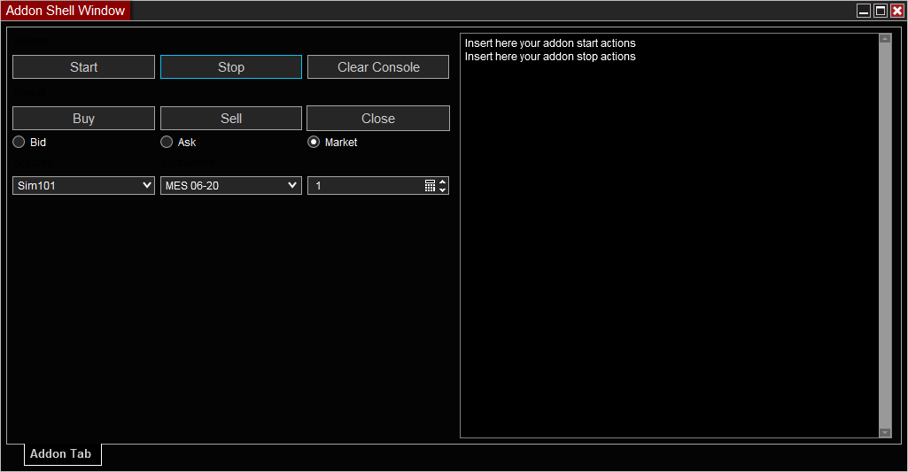

# NinjaTrader AddonShell Project

## About
AddonShellProject is an add-on for NinjaTrader. It serves as an example of how to use the NinjaTrader add-on framework and demonstrates some of its capabilities. The primary script in this project is called `AddonShell`, which extends `AddOnBase` and provides functionality for adding a custom menu item to the Control Center window.

Some technical features and capabilities demonstrated by this add-on include:
- Adding a custom menu item to the Control Center window
- Subscribing to events for when a new NTWindow is created or destroyed
- Checking if a specific NTWindow (in this case, the Control Center) is present
- Finding existing menu items in the Control Center's main menu
- Creating a new NTMenuItem with custom text and style
- Adding a click handler to the new NTMenuItem to perform an action when clicked

This add-on serves as a useful example for developers looking to create their own custom add-ons for NinjaTrader using the add-on framework.

## Prerequisites

To use this AddOn, you need to have NinjaTrader 8 installed on your computer. You also need to have basic knowledge of programming in C# and the development environment Visual Studio.

## Installation

To install this AddOn, follow these steps:

- Clone or download this repository to a local folder.
- Open the file NinjaTraderAddOnProject.sln in Visual Studio.
- Compile the project and copy the file AddonShellProject.dll generated to the folder Documents\NinjaTrader 8\bin\Custom\AddOns.
- Restart NinjaTrader 8 and check if the AddOn was loaded correctly.

## Usage

To use this AddOn, follow these steps:

- In the main menu of NinjaTrader 8, select Tools > Options > General > Miscellaneous > Allow custom assembly loading and check the option.
- In the main menu of NinjaTrader 8, select New > Custom Tab 1 or Custom Tab 2. These are the custom tabs created by the AddOn.
- In Custom Tab 1, you can see a window with a button that shows a message when clicked. In Custom Tab 2, you can see a window with a simple chart of a time series.

## Author

This AddOn is based on the sample code provided by NinjaTrader LLC and modified by Samuel Caldas. Some of the features of this AddOn are inspired by other third-party AddOns for NinjaTrader 8 . All credit goes to the original authors of these AddOns.

## Todo:
- Fix Bid and Ask
- Implement MarketData and MarketDepth output
